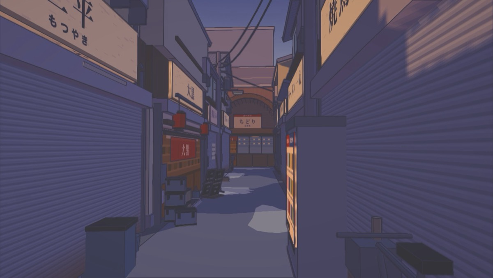
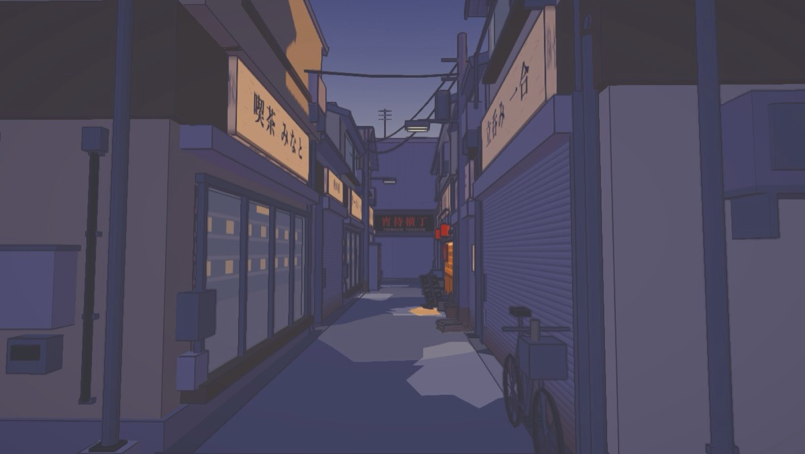
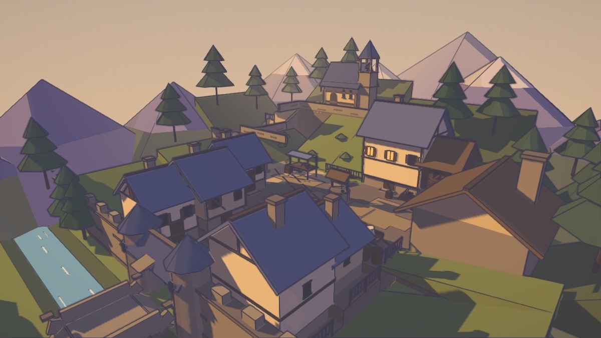
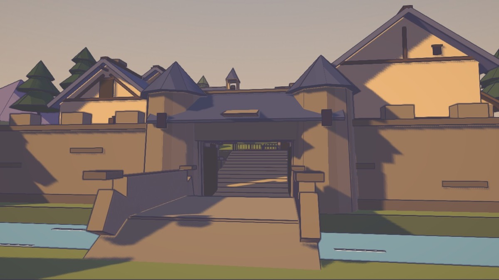
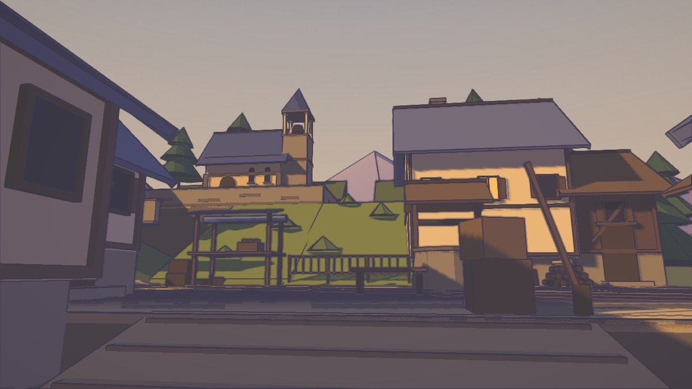
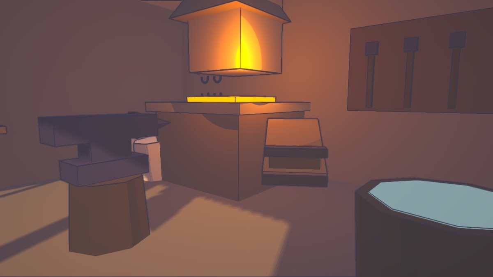
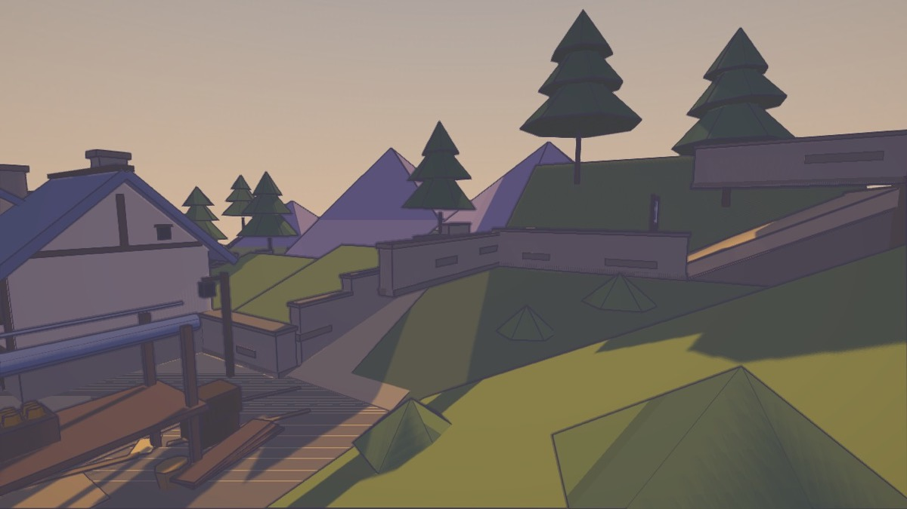

# sceneagent

Agent skills for building polished, explorable, stylized Three.js scenes from a
one-line prompt — with the quality machinery that makes the output trustworthy:
machine-checked gates, a screenshot-driven repair loop, and an independent
review protocol.

Two full runs, two different builder models, independently scored against a
0.78 acceptance bar (prior baselines: 0.58–0.69): *"Create a medieval mountain
village scene for a 3D game"* reached **0.777**, and *"Create a Tokyo scene"*
reached **0.801 — a clear pass** — each a coherent cel-shaded place with a
walkable route, story dressing, an interaction, gated cameras, and zero
floating or interpenetrating geometry.

## What one prompt produces

Every frame below is agent output from those one-line prompts — no human
edits, no external assets, everything procedural.



| | |
|---|---|
|  |  |

| | |
|---|---|
|  |  |
|  |  |

Full run histories with scores: [`docs/evidence/ferrun-hollow.md`](docs/evidence/ferrun-hollow.md)
and [`docs/evidence/yoimachi-yokocho.md`](docs/evidence/yoimachi-yokocho.md).

## What's inside

```
skills/
  build-stylized-threejs-scene/   the main skill: compact staged workflow
    SKILL.md                      the operating loop (read this first)
    references/                   craft references, read on demand
    scripts/                      contract validator, review scorer, stage state
    assets/vignette-starter/      the template every new scene copies
  scene-quality-loop/             the polish protocol: assemblies, spatial
                                  contracts, machine-validated review gates
docs/evidence/                    the measured results behind the design
.claude/skills/                   adapters so Claude Code discovers the skills
```

The **vignette-starter** is the heart of it. It ships:

- a **cel/ink/grade renderer** (quantized toon ramps with violet shadow tint,
  depth-second-difference ink outlines, split-tone grade) so scenes read as
  drawn, not as low-poly 3D;
- an **architecture kit** (`gableRoof`, `shedRoof`, `stairs`, `bankWedge`,
  `seatOnGround`) where every roof plane is derived from ridge/eave joints —
  misaligned assemblies are impossible by construction;
- a **camera-legibility gate**: every review camera declares a subject; a
  raycast + frustum + near-plane check blocks frames that don't show it;
- a **spatial audit**: ground-contact rays per prop (float/buried), contact
  sampling along wall runs, unexplained-mass detection, embedded-scatter
  parity tests, ground-hole grid — all headless-runnable with exit codes;
- a dev-only **`__shot` capture endpoint** so agents render and *read* frames
  without browser automation permissions;
- a first-person walker with colliders, review cameras, diagnostics.

## How to use it

**With Claude Code:** clone this repo (or copy `skills/` and `.claude/` into
your project). Ask for a scene: *"create a rainy harbor town at dusk for my
game."* The skill triggers, copies the starter, and runs the loop.

**With Codex or another harness:** point the agent at
`skills/build-stylized-threejs-scene/SKILL.md` and tell it to follow the skill.
Each skill directory also carries an `agents/openai.yaml` interface stanza.

**Manually:** copy `skills/build-stylized-threejs-scene/assets/vignette-starter/`
into a new directory, `npm install && npm run dev`, and build inside it. Run the
gates yourself:

```bash
python3 skills/build-stylized-threejs-scene/scripts/validate_scene_contract.py scene-contract.json
node scripts/check-cameras.mjs     # from the scene directory
node scripts/check-spatial.mjs     # from the scene directory
```

Requirements: Node 18+, Python 3 for the two validators.

## The design, in one paragraph

The controlled experiments behind this (see `docs/evidence/`) found that the
engineering scaffold transfers through a compact skill, but **composition only
transfers through renders**: no tested first pass ever met the quality bar, and
prose beyond ~300 words bought nothing. So the skill is deliberately short, the
loop is mandatory — capture every contracted camera *plus* orbit/route/roofline
sweeps, read the images, fix the single highest-impact defect, repeat 2–3
times — and everything mechanical is a script with an exit code rather than an
instruction an agent must remember. Builders never score their own work
(self-scores measured ~0.2 high); an independent review against the weighted
rubric in `SKILL.md` decides acceptance.

## Evidence

- `docs/evidence/skill-context-tests.md` — compact skills vs a 5,900-word
  baseline: scaffold transfers, composition doesn't; screenshot feedback is the
  decisive mechanism.
- `docs/evidence/sdk-comparison.md` — a narrow custom SDK over Three.js beat
  Babylon.js on every measured dimension for this use; the verdict behind the
  starter's design.
- `docs/evidence/ferrun-hollow.md` — the full-pipeline live test: one prompt →
  independent scores 0.748 → 0.764 → 0.777 across three review rounds, then two
  free-exploration hardening rounds that became permanent gates.

## License

MIT — see [LICENSE](LICENSE).
